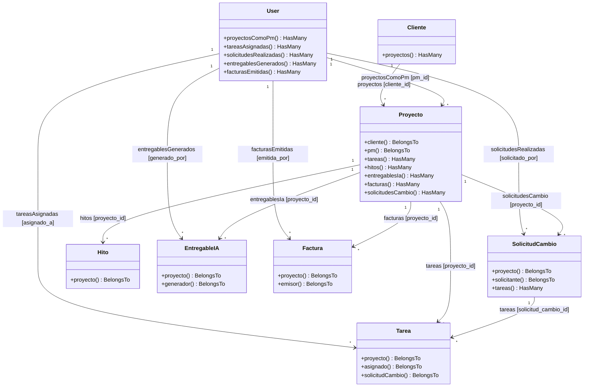

# CRUZNEGRA — Diagrama de Clases (Modelos Eloquent)

> Las 8 clases del modelo (`app/Models/`) con sus métodos de relación
> `belongsTo` / `hasMany`, tal como están implementadas.
>
> **Cómo verlo en VS Code:** extensión *"Markdown Preview Mermaid Support"* +
> vista previa (Ctrl+Shift+V). Para código puro, copiá el bloque `mermaid` a un `.mmd`.
>
> Lectura de las flechas: `Padre "1" --> "*" Hijo`. La etiqueta indica el método
> `hasMany` del padre y, entre corchetes, la FK. El método `belongsTo` inverso
> figura dentro de la clase hija.

## Resumen de relaciones por clase

| Clase | belongsTo (lado N) | hasMany (lado 1) |
|---|---|---|
| `Cliente` | — | `proyectos` |
| `User` | — | `proyectosComoPm`, `tareasAsignadas`, `solicitudesRealizadas`, `entregablesGenerados`, `facturasEmitidas` |
| `Proyecto` | `cliente`, `pm` | `tareas`, `hitos`, `entregablesIa`, `facturas`, `solicitudesCambio` |
| `SolicitudCambio` | `proyecto`, `solicitante` | `tareas` |
| `Tarea` | `proyecto`, `asignado`, `solicitudCambio` | — |
| `Hito` | `proyecto` | — |
| `EntregableIA` | `proyecto`, `generador` | — |
| `Factura` | `proyecto`, `emisor` | — |

> Todos los modelos usan además los traits `HasFactory` y `Auditable` (registro de
> cambios). `User` suma `Notifiable` y `HasRoles` (Spatie) para el manejo de roles.
