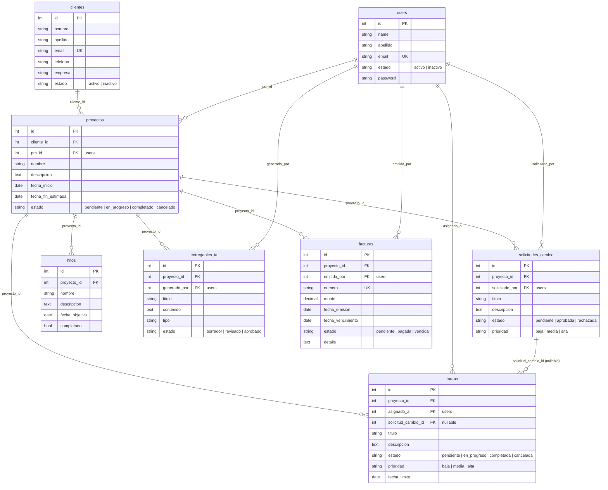

# CRUZNEGRA — Modelo Relacional (según migraciones)

> Diagrama entidad-relación que refleja el esquema **realmente implementado** en la base
> de datos `cruznegra` (las 8 migraciones de negocio). Versión simple, sin los campos
> extra del documento de análisis.
>
> **Cómo verlo en VS Code:** instalá la extensión *"Markdown Preview Mermaid Support"*
> y abrí la vista previa (Ctrl+Shift+V). Para el código puro, copiá el bloque `mermaid`
> a un archivo `.mmd` y usá la extensión *"Mermaid Preview"*.
>
> Convenciones: `PK` = clave primaria · `FK` = clave foránea · `UK` = único ·
> todas las relaciones son **1 : N** (`||--o{`). Todas las tablas tienen además
> `created_at` y `updated_at`. Los roles (Jefe, PM, PO, Programador, Cliente) se manejan
> con las tablas de Spatie Permission, no con una columna en `users`.

## Relaciones e integridad referencial

- `proyectos` referencia un `clientes` (`cliente_id`) y un usuario PM (`pm_id`).
- `solicitudes_cambio`, `hitos`, `entregables_ia` y `facturas` cuelgan de `proyectos`.
- `tareas.solicitud_cambio_id` es **nullable**: solo se completa cuando la tarea surge
  de una solicitud de cambio.
- Las FK hacia `proyectos`, `clientes` y `users` son `ON DELETE CASCADE`, salvo
  `tareas.solicitud_cambio_id`, que es `ON DELETE SET NULL`.
- Todas las relaciones son **1 : N**; no hay tablas pivote (N:N) entre entidades de negocio.
